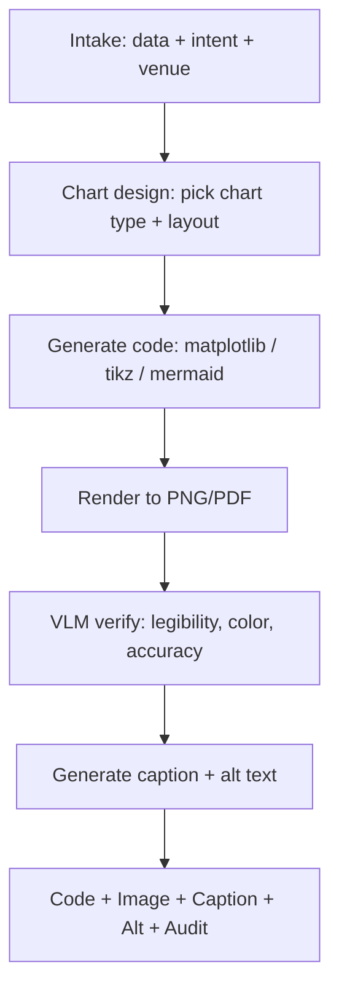

# ai-figure-smith — AI/ML Paper Figure & Table Smith

Generate accurate, accessible, venue-compliant figures with built-in VLM verification (catches matplotlib/tikz rendering bugs before reviewers do).

## 30-Second Start

```
"Plot accuracy vs distractor similarity, 4 models, error bars."
"Make the ablation table for §4. Data at ablation.csv."
"Design the qualitative comparison figure: input, baseline, ours."
"为我的实验结果做一张配图，柱状图，4个 baseline。"
```

## When to Use

| Use ai-figure-smith when | Use a different skill when |
|---|---|
| You have data and need a publication-quality figure | You need data analysis itself → external (pandas, etc.) |
| You're writing captions and alt text | You're drafting paper prose → `ai-paper-writer` |
| You want VLM verification of an existing figure | You need full integrity audit → `ai-integrity-check` |

## Inputs

| Field | Required | Example |
|---|---|---|
| `data` | yes | CSV/JSON path or inline |
| `chart_intent` | yes | `comparison` / `trend` / `distribution` / `ablation` / `qualitative-grid` / `architecture-diagram` |
| `tool` | recommended | `matplotlib` (default) / `tikz` / `seaborn` / `plotly` / `mermaid` |
| `venue` | recommended | Drives column width, font sizes, colorblind palettes |
| `caption_draft` | optional | If user wants caption polishing too |
| `accessibility` | optional | `colorblind-safe` (default), `print-bw-safe` |

## Outputs

### 1. Figure Code

Reproducible script (matplotlib / tikz / mermaid). Includes:
- Inline data or path reference
- Style settings matching venue
- Save command with target filename and DPI

### 2. Caption Draft

```yaml
caption:
  short: "Accuracy vs distractor similarity across 4 models."
  full: |
    Figure 1: Long-context accuracy degrades monotonically with distractor-needle
    cosine similarity across all four evaluated models. Shaded regions show
    standard deviation across 5 random seeds. Llama-3.1-70B and Qwen2.5-72B
    show similar trends; GPT-4o is most robust at high similarity.
  forward_pointer: "(see §4.2 for the controlled comparison setup)"
```

### 3. Alt Text

For accessibility (and required by ACL ethics statement, recommended by NeurIPS):

```yaml
alt_text: |
  Line plot. X-axis: distractor-needle cosine similarity from 0.3 to 0.9
  (4 buckets). Y-axis: accuracy from 0 to 100%. Four lines (Llama-3.1-70B,
  Qwen2.5-72B, GPT-4o, GPT-4o-mini). All lines decrease as similarity
  increases. Llama drops from 91% to 53%; Qwen from 89% to 56%;
  GPT-4o from 95% to 78%; GPT-4o-mini from 88% to 41%.
```

### 4. VLM Verification Report

```yaml
vlm_audit:
  rendered_correctly: yes | no | warnings
  legibility:
    smallest_font_pt: 7
    venue_minimum_pt: 6
    pass: yes
  color:
    colorblind_safe: yes
    distinguishable_in_bw: warning
  anomalies: []
  caption_matches_figure: yes
```

## Workflow



## Agents (delegated to existing v3 components)

| Agent | Role | File |
|---|---|---|
| `visualization_agent` | Core chart generation + design | [`archive/v3/academic-paper/agents/visualization_agent.md`](../archive/v3/academic-paper/agents/visualization_agent.md) |

## Key Protocols

- [`archive/v3/academic-paper/references/vlm_figure_verification.md`](../archive/v3/academic-paper/references/vlm_figure_verification.md) — VLM-based rendering audit
- [`archive/v3/academic-paper/references/statistical_visualization_standards.md`](../archive/v3/academic-paper/references/statistical_visualization_standards.md) — quality checklist
- [`shared/venue_db/<venue>.yaml`](../shared/venue_db/) — venue typography and layout

## IRON RULES

1. **Reproducible code**, not "AI-generated" image. Every figure = code that runs.
2. **VLM verification mandatory** for output figures. If user wants to skip, must explicitly opt out per session.
3. **Numbers in figure must come from `data`.** No invented values, no smoothing without disclosure.
4. **Colorblind-safe by default.** Override only with explicit user request.
5. **Alt text required** for venues with accessibility requirements (ACL/EMNLP); strongly recommended for all.

## Anti-Patterns

| # | Anti-Pattern | Correct Behavior |
|---|---|---|
| 1 | Generating image without code | Always emit reproducible script |
| 2 | Rainbow / jet colormap for ordinal data | viridis, cividis, or sequential |
| 3 | Tiny fonts (<6pt) | Honor venue minimum |
| 4 | Missing axis labels | Always label; include units |
| 5 | Bar charts where lines would be clearer (or vice versa) | Match chart type to data structure |
| 6 | Hiding error bars or variance | Always show; if too small to plot, state that |
| 7 | 3D bar charts | Refuse — never readable |
| 8 | Same figure twice with different captions | Refuse — caption mismatch is a reviewer red flag |

## Chart-Type Guide (rule of thumb)

| Intent | Chart type | Notes |
|---|---|---|
| Compare 2-5 categorical results | grouped bar | Add error bars |
| Compare ordered/continuous results | line | Add shaded confidence band |
| Show distribution | violin or box plot | Avoid pure histogram for >2 conditions |
| Ablation study | table | Charts often less readable than table for ablations |
| Method architecture | tikz / draw.io / mermaid | Code-based for editability |
| Qualitative comparison | grid figure | Caption explains row/column structure |
| Loss/training curves | line | Log scale on y-axis often appropriate |

## See Also

- `ai-paper-writer` — inserts figure references in prose
- `ai-venue-formatter` — compiles figures into the venue template
- `ai-integrity-check` — verifies figure data matches reported numbers
- `academic-paper` (legacy) — root visualization machinery
