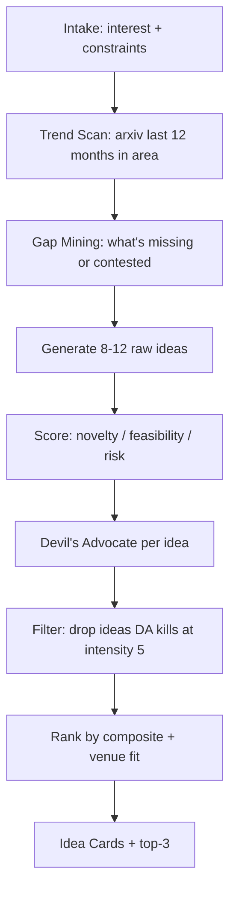

# ai-idea-forge — AI/ML Research Idea Generator

Turn a vague interest into a ranked list of testable, novelty-scored research ideas with minimum-viable experiments. Built for AI/ML researchers working toward NeurIPS/ICLR/ICML/ACL/EMNLP submission.

## 30-Second Start

```
"Give me ideas on long-context LLM evaluation. I have 8 H100s for 2 months."
"Brainstorm research directions in mechanistic interpretability for diffusion models."
"想几个 RLHF reward hacking 方向的 idea，3 个月时间，没有 GPU 集群。"
```

You'll get 5-10 Idea Cards, ranked, with the top 3 highlighted.

## When to Use

| Use ai-idea-forge when | Use a different skill when |
|---|---|
| You have an interest area but no specific RQ | You already have an RQ → `ai-lit-scout` |
| You want novelty estimates against existing work | You want to position vs specific papers → `ai-related-positioning` |
| You need to choose between candidate directions | You're ready to design experiments → `ai-method-architect` |

## Inputs

| Field | Required | Example |
|---|---|---|
| `interest_area` | yes | "long-context LLM evaluation" |
| `constraints.compute` | yes | "8 H100s, 2 months" |
| `constraints.data_access` | yes | "public datasets only" |
| `constraints.timeline` | recommended | "submit to ICLR 2027 (deadline late Sept)" |
| `target_venues` | recommended | `[neurips, iclr]` (looked up in `shared/venue_db/`) |
| `existing_reads` | optional | List of papers you've read in the area |
| `style_preference` | optional | `theoretical` / `empirical` / `applied` / `position-paper` |

## Outputs

A YAML + Markdown bundle:

```yaml
# Top of file: scan summary
session: <id>
interest_area: <verbatim>
candidates_generated: <int>
candidates_kept: <int>          # after DA filtering
top_3: [<idea-id-1>, <idea-id-2>, <idea-id-3>]

# Per idea (5-10 cards):
- id: idea-001
  one_line_claim: "<verb-led, falsifiable>"
  motivation: "<why this matters in 2 sentences>"
  novelty_score: <1-5>          # vs nearest known work
  feasibility_score: <1-5>      # given user constraints
  risk_score: <1-5>             # 1=safe, 5=could fail entirely
  minimum_experiment:
    setup: <1-3 sentences>
    metrics: [...]
    expected_signal: <what tells you it worked>
    estimated_compute: <hours>
  closest_existing_work:
    - title: ...
      arxiv_id: ...
      differentiation: <1 sentence — what's new vs this paper>
  devils_advocate:
    strongest_attack: <1 sentence>
    intensity: <1-5>
    mitigation: <how to defuse if you proceed>
  fits_venue: [<venue-tags>]
  recommended: <true|false>
```

A Markdown summary is generated alongside for human reading.

## Workflow



## Agents

| Agent | Role | File |
|---|---|---|
| `idea_intake_agent` | Lightweight interview (≤4 questions) | `agents/idea_intake_agent.md` |
| `trend_scanner_agent` | Pulls recent arxiv trends in area via WebSearch | `agents/trend_scanner_agent.md` |
| `gap_miner_agent` | Identifies underexplored intersections | `agents/gap_miner_agent.md` |
| `idea_generator_agent` | Composes Idea Cards from gaps + constraints | `agents/idea_generator_agent.md` |
| `novelty_scorer_agent` | Scores each idea against closest known work | `agents/novelty_scorer_agent.md` |
| `devils_advocate` (shared) | Stress tests each idea | `../shared/agents/devils_advocate.md` |
| `socratic_mentor` (shared) | Used when intake reveals user is unsure | `../shared/agents/socratic_mentor.md` |

## IRON RULES

1. **No fabricated citations**: Every "closest existing work" entry must be verifiable via WebSearch or Semantic Scholar. If unsure, flag as `unverified` and ask user.
2. **Devil's Advocate cannot be skipped**: Every Idea Card carries a DA critique with intensity score. Ideas with intensity-5 attacks AND no mitigation are filtered out, not kept.
3. **Constraints are hard, not aspirational**: If user says "8 H100s for 2 months", every Idea Card's `estimated_compute` must fit. Ideas exceeding constraints are dropped or downsized.
4. **Specificity over breadth**: 5 sharp ideas > 20 vague ones. If quality drops, generate fewer rather than more.
5. **Venue fit is informational, not gating**: Tag which venues fit but don't reject ideas that don't fit any listed venue — note "preprint only" and continue.

## Anti-Patterns

| # | Anti-Pattern | Correct Behavior |
|---|---|---|
| 1 | "Use LLMs for X" framings | Frame as testable hypothesis with falsifiable metric |
| 2 | Ideas requiring private data the user doesn't have | Drop or substitute public dataset analog |
| 3 | "Novel because nobody has tried" without checking | Run trend_scanner_agent first; novelty = unaddressed *gap*, not absence of attempt |
| 4 | Composite scores hiding weakness | Show all three dimensions separately; never average into single number |
| 5 | Letting DA reject everything | If DA kills 100% of ideas, the area is mature — pivot to position-paper or survey suggestion |

## Resume Pattern

Sessions are persisted via `shared/agents/state_tracker.md`. Users can:

```
"Resume ai-idea-forge from yesterday."
"Refine idea-003 — make it more empirical."
"Add another constraint: no human eval."
```

## Handoff

When the user picks an idea to pursue:

```
→ ai-lit-scout            "Find papers I should cite for idea-003"
→ ai-related-positioning  "Position idea-003 vs RULER and LongBench"
→ ai-method-architect     "Design experiments for idea-003"
```

State tracker writes the chosen idea card to handoff_artifact for downstream skills.

## References

- `references/novelty_taxonomy.md` — 5 types of novelty in AI/ML
- `references/feasibility_rubric.md` — what compute/data/timeline really cost
- `references/idea_anti_patterns.md` — common bad framings
- `templates/idea_card.yaml` — schema
- `examples/long_context_eval_session.md` — full example transcript

## See Also

- `shared/agents/devils_advocate.md`
- `shared/agents/socratic_mentor.md`
- `shared/protocols/anti_sycophancy.md`
- `shared/venue_db/` — venue tags
