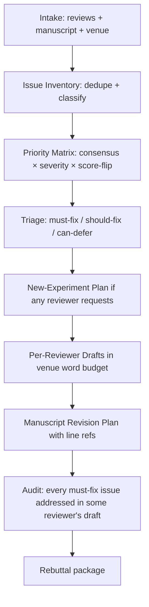

# ai-rebuttal-coach — AI Venue Rebuttal Helper

The author response phase is decisive at OpenReview venues (ICLR, NeurIPS) and consequential at ACL/CVPR (1500 words / 1 page). This skill produces prioritized, venue-compliant rebuttal drafts that materially affect reviewer scores.

## 30-Second Start

```
"Help me rebut these NeurIPS reviews: [paste]"
"Write the ICLR author response. Manuscript at paper.tex."
"ACL rebuttal, 1500 words across 3 reviewers."
"为这份 ICML 审查意见写 rebuttal，5000 字限制。"
```

## When to Use

| Use ai-rebuttal-coach when | Use a different skill when |
|---|---|
| You have actual reviewer comments | Pre-submission self-review → `ai-paper-reviewer` |
| You're under venue word/page limits | You want a full revision → `ai-paper-writer revise mode` |
| You need to triage and prioritize | You need to update related work for new reviewer-mentioned papers → `ai-related-positioning` |

## Inputs

| Field | Required | Example |
|---|---|---|
| `reviews` | yes | Markdown or text of all reviewer comments |
| `manuscript` | yes | Path or pasted text |
| `venue` | yes | Tag from `shared/venue_db/` (drives word limits, format) |
| `meta_review` | optional | If AC has commented |
| `prior_rebuttal` | optional | For multi-round venues like ICLR |
| `experimental_capacity` | recommended | What experiments you CAN add during rebuttal period (e.g., "1 ablation, no new datasets") |

## Outputs

### 1. Issue Inventory (parsed)

Every distinct concern across all reviewers, deduplicated:

```yaml
issues:
  - id: issue-001
    raised_by: [r1, r2]            # multiple reviewers raise = high priority
    severity: critical | major | minor | clarification
    category: experimental | conceptual | writing | missing_related | scope
    text: <verbatim concern>
    affects_score: <yes|no|unclear>
```

### 2. Priority Matrix

Issues ranked by:
- Number of reviewers raising it (consensus = highest)
- Severity
- Whether addressing it can flip a reviewer's decision

### 3. Per-Reviewer Response Drafts

Tailored to each reviewer in the venue's word budget:

```
Reviewer 1 (1200 words):
[Acknowledgment]
[Critical concern 1: response]
[Critical concern 2: response]
[Major concern 1: response]
[Minor: brief noted]

Reviewer 2 (1500 words):
...
```

### 4. Revision Plan

Manuscript edits that should accompany the rebuttal:

```yaml
revisions:
  - location: "§4 Method, paragraph 2"
    change_type: clarification | new_text | new_experiment | citation_addition
    description: "Clarify that distractor selection is similarity-controlled."
    addresses_issue: [issue-001]
```

### 5. New-Experiment Plan (if needed)

If reviewers request experiments achievable in rebuttal window:

```yaml
new_experiments:
  - description: "Ablation over similarity buckets {0.3, 0.5, 0.7, 0.9}"
    estimated_compute: 12 hours
    estimated_wall: 2 days
    addresses_issue: [issue-002, issue-005]
    feasibility: yes | tight | no
    if_no_alternative: <how to address without the experiment>
```

## Workflow



## Agents

| Agent | Role | File |
|---|---|---|
| `review_parser_agent` | Extract issue inventory from raw reviews | `agents/review_parser_agent.md` |
| `prioritizer_agent` | Build priority matrix | `agents/prioritizer_agent.md` |
| `experiment_planner_agent` | Decide which new experiments to run | `agents/experiment_planner_agent.md` |
| `response_drafter_agent` | Compose per-reviewer drafts | `agents/response_drafter_agent.md` |
| `revision_planner_agent` | Produce manuscript edit plan | `agents/revision_planner_agent.md` |
| `auditor_agent` | Verify all critical issues addressed | `agents/auditor_agent.md` |
| `devils_advocate` (shared) | Predict reviewer counter-arguments to drafts | `../shared/agents/devils_advocate.md` |

## IRON RULES

1. **Word/page limit is hard.** Every per-reviewer response must fit the venue's limit (lookup `shared/venue_db/<venue>.yaml`). Overlong drafts MUST be cut, not submitted.
2. **No fabricated experiments.** If a draft claims "we ran experiment X", X must actually exist in `experimental_capacity` or be in the manuscript already. Never imply unrun experiments.
3. **Anti-sycophancy applies.** Per `shared/protocols/anti_sycophancy.md`: not every reviewer concern deserves concession. If a concern reflects misreading or is wrong, say so respectfully — don't capitulate.
4. **No ad-hominem, no exasperation, no reviewer-shaming.** Even when a reviewer is wrong. Tone is professional, evidence-led.
5. **Every "we will add X" claim creates a revision-plan entry.** No promises that don't get tracked.
6. **Critical-severity issue must be addressed in at least one reviewer's response.** Auditor blocks if any are missing.

## Anti-Patterns

| # | Anti-Pattern | Correct Behavior |
|---|---|---|
| 1 | "Thanks for the great review!" opening | Brief professional acknowledgment, then substance |
| 2 | "We agree with the reviewer that…" used to soften disagreement | Either agree (and concede) or disagree (and defend) — no fence-sitting |
| 3 | Promising experiments you can't do in the rebuttal window | Use experiment_planner; flag if infeasible and explain |
| 4 | Citing the same response across multiple reviewers verbatim | Tailor each response to the specific framing the reviewer used |
| 5 | Burying the answer to the reviewer's main concern in paragraph 4 | Lead each response with the most score-affecting concern |
| 6 | Hand-waving on missing-related-work concerns | Use `ai-related-positioning` to compute proper differentiation |
| 7 | Crossing the word limit and trimming randomly | Trim by removing minor-severity responses first; never cut critical |
| 8 | Tone shifts (apologetic → assertive → defensive) | Maintain consistent professional tone across all reviewers |

## Venue-Specific Notes (lookup on invocation)

- **NeurIPS / ICML**: Single rebuttal round; ≈5000-6000 words total. Make it count.
- **ICLR**: Multi-round OpenReview. First response is the highest-leverage; subsequent rounds for clarification only.
- **ACL / EMNLP**: 1500 words across all reviewers. Use bullet points; cut ruthlessly.
- **CVPR**: 1-page PDF (with figures!). Use figures aggressively to address experimental questions.
- **AAAI**: ~4500 words. Standard format.

## Resume / Handoff

State persisted via `shared/agents/state_tracker.md`. Common handoffs:

- Issue inventory → `ai-paper-writer` (revision mode) for full revision after rebuttal
- Reviewer-threat patterns → `ai-paper-reviewer` (calibration mode) for next paper
- Missing related work → `ai-related-positioning` for proper coverage

## References

- `references/rebuttal_anti_patterns.md` — common failure modes
- `references/concession_protocol.md` — when to agree vs hold position
- `references/experiment_during_rebuttal.md` — what's feasible in 7-21 days
- `references/venue_phrasing_conventions.md` — opening/closing patterns by venue
- `templates/rebuttal_per_reviewer.md`
- `templates/issue_inventory.yaml`
- `examples/neurips_rebuttal_session.md`

## See Also

- `ai-paper-reviewer` — to anticipate reviewer concerns BEFORE submission
- `ai-paper-writer` (revise mode) — for full revision after rebuttal acceptance
- `ai-related-positioning` — when reviewers ask for missing related work
- `ai-integrity-check` — before submitting rebuttal claims about new experiments
- `shared/protocols/anti_sycophancy.md`
- `shared/venue_db/`
