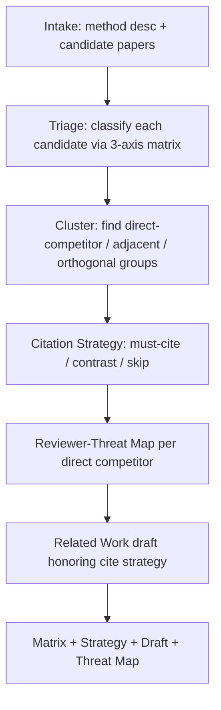

# ai-related-positioning — Differentiate Your Work from Existing Papers

The single most common reviewer complaint at AI venues is "missing related work" or "unclear differentiation". This skill produces a defensible positioning matrix and a Related Work section that survives reviewer scrutiny.

## 30-Second Start

```
"My method does X. How is it different from RULER, LongBench v2, Needle-in-haystack?"
"Position my work on diffusion editing vs InstructPix2Pix and Imagic."
"写 related work，对比 paper A/B/C/D，3 段。"
```

You'll get a positioning matrix and a draft Related Work section.

## When to Use

| Use ai-related-positioning when | Use a different skill when |
|---|---|
| You know which papers might overlap and need to articulate differences | You don't know which papers to compare → `ai-lit-scout` |
| You're writing the Related Work section | You're writing other sections → `ai-paper-writer` |
| Reviewer asks "how is this different from X" → defending | Need a full review report → `ai-paper-reviewer` |

## Inputs

| Field | Required | Example |
|---|---|---|
| `my_method_description` | yes | 1-page Markdown describing your method, claim, experiments |
| `candidate_papers` | yes | List of 5-15 papers (title + arxiv_id + key claim) |
| `target_section_length` | recommended | "3 paragraphs" / "1 page" / "2 columns" |
| `venue` | optional | venue tag → looked up in `shared/venue_db/` for related-work conventions |
| `framing` | optional | `defensive` (rebuttal context) or `narrative` (paper writing) |

## Outputs

### 1. Positioning Matrix (CSV + Markdown)

Per candidate paper, three axes:

| Axis | Question | Possible answers |
|---|---|---|
| Method | Same algorithmic family? | same / similar / different / orthogonal |
| Data | Same evaluation setting? | same / overlapping / disjoint |
| Claim | Same scientific contribution? | same / adjacent / orthogonal / contradictory |

The matrix surfaces clusters: papers in the "same method, same data" cell are direct competitors and need careful framing; "orthogonal" papers may not need to be cited at all.

### 2. Citation Strategy

For each candidate:

```yaml
- paper_id: arxiv:2404.06654
  cite_priority: must-cite | contrast-cite | optional | skip
  rationale: <1-2 sentences>
  suggested_citation_context: <e.g., "in motivation paragraph as prior benchmark", "in differentiation paragraph as direct competitor">
```

### 3. Related Work Draft

A draft Related Work section honoring the cite strategy, in the venue's expected format.

### 4. Reviewer-Threat Map

For each candidate paper, predict the reviewer's likely concern:

```yaml
- paper_id: arxiv:2404.06654
  likely_reviewer_concern: "Reviewer may say our method is just RULER with different distractor selection."
  preemptive_response: <1-2 sentences to add to Related Work that defuses this>
```

## Workflow



## Agents

| Agent | Role | File |
|---|---|---|
| `triage_agent` | 3-axis classification per candidate | `agents/triage_agent.md` |
| `cluster_agent` | Group candidates by competitive proximity | `agents/cluster_agent.md` |
| `strategy_agent` | Decide cite priority per candidate | `agents/strategy_agent.md` |
| `threat_modeler_agent` | Predict reviewer concerns | `agents/threat_modeler_agent.md` |
| `related_work_writer_agent` | Compose draft section | `agents/related_work_writer_agent.md` |

## IRON RULES

1. **Specific differentiation, not generic**: "Different from X" is not enough. Must name *which axis* differs and *how much*.
2. **Cannot drop a direct competitor**: If a candidate is in the "same method, same data" cell, it MUST be cited (cite_priority: must-cite). Skipping = academic dishonesty.
3. **Reviewer-threat map is non-optional for direct competitors**: Every must-cite paper has a likely_reviewer_concern entry. If you cannot articulate the threat, the differentiation is too thin.
4. **Honor venue conventions**: NeurIPS Related Work is short (< 1 page); ACL puts it after Introduction; CVPR often has it as final section. Use `shared/venue_db/`.
5. **No hallucinated papers**: All candidate_papers must be verifiable. If a user provides a paper that cannot be verified, request a corrected reference rather than guessing.

## Anti-Patterns

| # | Anti-Pattern | Correct Behavior |
|---|---|---|
| 1 | "X is similar but different" — no specifics | Name the axis (method/data/claim) and the magnitude of difference |
| 2 | Listing 30 papers in one paragraph (carpet bombing) | Cluster into 3-5 themes, 1 paragraph per theme |
| 3 | Burying differentiation in middle of paragraph | Lead each paragraph with the differentiation |
| 4 | Praising competitors without distinguishing | Acknowledge contribution, then state difference in same sentence |
| 5 | "Concurrent work" used as escape hatch | Only valid for arxiv-dated work within ±2 months; cite anyway |

## Resume / Handoff

State persisted via `shared/agents/state_tracker.md`. Output handoff_artifacts:

- Positioning matrix → consumable by `ai-paper-writer` (when drafting Related Work)
- Reviewer-threat map → consumable by `ai-paper-reviewer` (predicts review concerns) and `ai-rebuttal-coach` (when rebuttal addresses missing-related-work complaint)

## References

- `references/positioning_axes.md` — detailed 3-axis taxonomy
- `references/related_work_patterns_by_venue.md` — venue-specific conventions
- `references/concurrent_work_protocol.md` — when and how to invoke "concurrent work"
- `templates/positioning_matrix.csv`
- `templates/related_work_section.md`

## See Also

- `ai-lit-scout` — finds the candidate papers in the first place
- `ai-paper-writer` — consumes the positioning output to write other sections
- `ai-rebuttal-coach` — uses reviewer-threat map when responding to missing-related-work complaints
- `shared/venue_db/`
