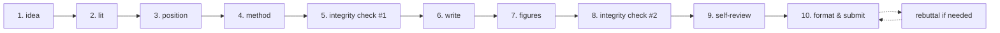

# ai-research-pipeline — Optional Full-Workflow Orchestrator

Most users should invoke atomic skills directly (`ai-idea-forge`, `ai-lit-scout`, `ai-paper-writer`, etc.). This meta-skill exists for users who explicitly want a coordinated end-to-end workflow with checkpoints.

## When to Use This (Be Honest)

| Use ai-research-pipeline when | Use atomic skills when |
|---|---|
| You want to be guided through every stage | You know what stage you're at |
| You want enforced integrity gates between stages | You'll invoke ai-integrity-check yourself when needed |
| You want resume-from-stage support | You're working on one specific task |
| You're new to AI venue submission and want scaffolding | You're an experienced researcher |

If you're not sure: **start with atomic skills.** This meta-skill adds overhead.

## The 10 Stages (lightweight)



| Stage | Skill | Mandatory? |
|---|---|---|
| 1 | `ai-idea-forge` | No (skip if user has RQ) |
| 2 | `ai-lit-scout` | Yes |
| 3 | `ai-related-positioning` | Yes |
| 4 | `ai-method-architect` | Yes for new work; skip for survey |
| 5 | `ai-integrity-check pre-review` | Yes (after method+early results) |
| 6 | `ai-paper-writer` (multi-section) | Yes |
| 7 | `ai-figure-smith` | Yes |
| 8 | `ai-integrity-check final-check` | Yes |
| 9 | `ai-paper-reviewer` | Yes |
| 10 | `ai-venue-formatter` | Yes |
| post | `ai-rebuttal-coach` | If reviews come back |

## Checkpoint Discipline

Compared to v3.3 (which had 7-10 mandatory checkpoints), v4.0 has **3 mandatory checkpoints**:

1. **Post-Stage 3** (after positioning): "Are you committed to this differentiation? Going forward will assume it."
2. **Post-Stage 5** (integrity check): If `BLOCK`, mandatory user decision.
3. **Post-Stage 9** (self-review): "Address critical reviewer concerns before formatting?"

All other transitions are automatic with stage-completion notification (not blocking).

## Inputs

| Field | Required | Example |
|---|---|---|
| `start_at_stage` | recommended | `1` (default) / any stage 1-10 |
| `end_at_stage` | recommended | `10` (default) |
| `interest_area` OR `research_question` | yes | (depends on starting stage) |
| `venue` | yes | Tag from `shared/venue_db/` |
| `materials` | varies by stage | What you already have |

## Outputs

A research project workspace structured around the 10 stages:

```
project/
├── stage-1-idea/idea_cards.yaml
├── stage-2-lit/bibliography.yaml
├── stage-3-position/positioning_matrix.csv
├── stage-4-method/protocol.yaml
├── stage-5-integrity/audit_report.yaml
├── stage-6-write/sections/{abstract.md, intro.md, ...}
├── stage-7-figures/{fig1.py, fig1.pdf, ...}
├── stage-8-integrity/final_audit.yaml
├── stage-9-review/reviews/{r1.yaml, ..., meta.yaml}
└── stage-10-format/{main.tex, main.pdf, ...}

.ars-state/
└── pipeline-active.yaml          # tracks current stage, decisions, history
```

## Agents

| Agent | Role | File |
|---|---|---|
| `pipeline_orchestrator_agent` | Stage transitions and checkpoint logic | [`archive/v3/academic-pipeline/agents/pipeline_orchestrator_agent.md`](../archive/v3/academic-pipeline/agents/pipeline_orchestrator_agent.md) |
| `state_tracker` (shared) | Cross-stage state persistence | [`shared/agents/state_tracker.md`](../shared/agents/state_tracker.md) |

## IRON RULES

1. **Atomic skills are first-class.** This meta-skill never re-implements atomic skill logic; it only orchestrates.
2. **Resume must work at any stage.** State_tracker writes after each stage; user can resume from stage N without re-running 1..N-1.
3. **Only 3 mandatory checkpoints** (down from 7-10 in v3.3). Other transitions auto-proceed unless user interrupts.
4. **ai-integrity-check at Stage 5 and Stage 8 is non-negotiable.** Block-on-suspect verdict cannot be auto-overridden by orchestrator; user must decide.
5. **Stage skipping requires explicit consent** ("I want to skip Stage 3"); orchestrator confirms before skipping.

## Anti-Patterns

| # | Anti-Pattern | Correct Behavior |
|---|---|---|
| 1 | Promoting ai-research-pipeline as "the way" | Most users want atomic; surface only on explicit request |
| 2 | Restoring v3.3-style 7-10 checkpoint cadence | 3 max in v4.0 |
| 3 | Re-implementing skill logic in orchestrator | Orchestrator delegates only |
| 4 | Silent stage skipping | Always confirm |
| 5 | Long intake interviews | Reuse atomic skills' lightweight intakes |

## Resume

```
"resume pipeline"
"resume pipeline at stage 6"
"rewind to stage 4 and try a different method"
```

`state_tracker` reads `.ars-state/pipeline-active.yaml` and dispatches.

## See Also

- All 10 atomic skills above
- [`academic-pipeline`](../archive/v3/academic-pipeline/) (legacy v3.3) — for the original 10-stage strict pipeline; deprecated but kept for backward compat during 6-month migration
- [`docs/COMMAND_INDEX.md`](../docs/COMMAND_INDEX.md) — atomic skill triggers
