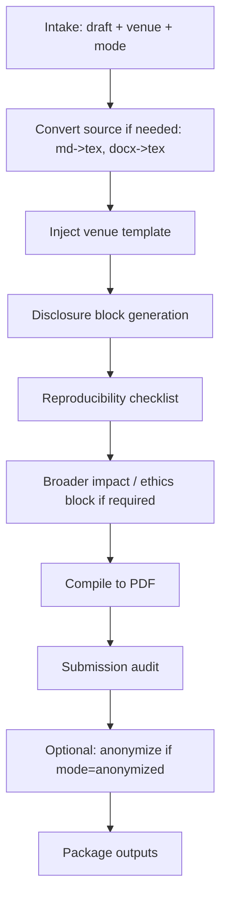

# ai-venue-formatter — AI Venue Submission Packager

Take a draft + figures + bibliography and produce a venue-compliant submission package: properly templated source, complete disclosure / reproducibility / broader-impact sections, and a submission-ready PDF.

## 30-Second Start

```
"Compile this paper for NeurIPS submission."
"Format for ICLR; need anonymized version too."
"Fill the NeurIPS Reproducibility Checklist."
"Camera-ready helper for ACL accept — what changes are needed?"
"Write the AI use disclosure for OpenReview."
"打包成 NeurIPS 投稿。"
```

## When to Use

| Use ai-venue-formatter when | Use a different skill when |
|---|---|
| You have a draft and need final compilation | You're still drafting → `ai-paper-writer` |
| You need reproducibility / disclosure / broader-impact | You need the experimental method → `ai-method-architect` |
| You want camera-ready help post-acceptance | You want pre-submission integrity → `ai-integrity-check` |

## Inputs

| Field | Required | Example |
|---|---|---|
| `draft` | yes | Path to .tex / .md (will be converted) |
| `venue` | yes | Tag from `shared/venue_db/` |
| `figures` | recommended | Directory of figures (PNG/PDF) |
| `bibliography` | recommended | .bib file |
| `mode` | optional | `submission` (default) / `anonymized` / `camera-ready` / `arxiv-export` |
| `disclosure_inputs` | optional | LLM/AI tool usage details (or invoke disclosure interview) |
| `reproducibility_inputs` | optional | Code release status, compute, data access details |

## Outputs

### 1. Compiled PDF

In venue's official template (NeurIPS / ICLR / ICML / ACL / CVPR / AAAI / arxiv).

### 2. Formatted Source

```
out/
├── main.tex                  # in venue template
├── main.pdf
├── references.bib
├── figures/                  # copied + renamed if needed
├── supplementary.tex         # if appendix
├── disclosure.tex            # AI use disclosure block
├── reproducibility_checklist.tex
└── broader_impact.tex        # if venue requires
```

### 3. Disclosure Block

Generated to match the venue's required format:
- **NeurIPS**: Acknowledgments OR Appendix; explicit if LLM use exceeded polishing
- **ICLR**: Acknowledgments
- **ACL/EMNLP**: Limitations section (specific format)
- **CVPR**: Acknowledgments (IEEE policy)

### 4. Reproducibility Checklist

For venues that require:
- **NeurIPS Paper Checklist**: 30+ questions answered
- **AAAI Reproducibility Checklist**: filled
- **ARR Responsible NLP Checklist** (ACL/EMNLP): filled
- **ICLR Reproducibility Statement**: written

### 5. Broader Impact / Ethics

For venues that require:
- **NeurIPS Broader Impacts**: optional but strongly recommended
- **ACL Ethics Statement**: mandatory
- **ICLR Broader Impact**: recommended

### 6. Submission Audit

```yaml
audit:
  page_count_main: 8.7 / 9 (limit)
  page_count_references: 3.2 / unlimited
  fonts: <list>; smallest: 7pt (venue min: 6pt)
  colorblind_safe: yes
  anonymization: pass | fail (if applicable)
  links_resolve: yes
  bib_complete: yes
  required_sections_present:
    abstract: yes
    limitations: yes
    ethics: yes
    reproducibility: yes
```

## Workflow



## Agents (delegated to existing v3 components)

| Agent | Role | File |
|---|---|---|
| `formatter_agent` | Template injection + compile | [`archive/v3/academic-paper/agents/formatter_agent.md`](../archive/v3/academic-paper/agents/formatter_agent.md) |
| `citation_compliance_agent` | Bib coherence + style match | [`archive/v3/academic-paper/agents/citation_compliance_agent.md`](../archive/v3/academic-paper/agents/citation_compliance_agent.md) |

## Key Protocols

- [`shared/venue_db/<venue>.yaml`](../shared/venue_db/) — page limits, template, checklist URLs
- [`archive/v3/academic-paper/references/disclosure_mode_protocol.md`](../archive/v3/academic-paper/references/disclosure_mode_protocol.md) — AI use disclosure (legacy v3 reference)
- [`archive/v3/academic-paper/references/venue_disclosure_policies.md`](../archive/v3/academic-paper/references/venue_disclosure_policies.md) — venue-specific disclosure policy matrix
- `shared/venue_db/*.yaml` `template:` field — link to each venue's official LaTeX template

## Modes

| Mode | When | Outputs |
|---|---|---|
| `submission` | default; first-time submission | Anonymized + main PDF + supplementary |
| `anonymized` | venue requires double-blind | Strip author info, GitHub links, etc. |
| `camera-ready` | post-accept | De-anonymize + fill metadata + final disclosure |
| `arxiv-export` | release on arXiv | arXiv-style template, includes acknowledgments |

## Camera-Ready Helper Mode

When `mode: camera-ready`:

1. List required changes per venue (typically: de-anonymize, add author info, full acknowledgments, license declaration, code release link)
2. Apply de-anonymization
3. Generate license block (CC-BY / CC-BY-NC / publisher-assigned)
4. Verify code/data release links resolve
5. Include reviewer-requested revisions (if `revision_plan` provided from `ai-rebuttal-coach`)

## IRON RULES

1. **Page limit is hard.** If draft exceeds page limit, formatter REFUSES to submit. User must trim via `ai-paper-writer revise mode`.
2. **Anonymization audit is hard for double-blind venues.** GitHub links, author email leaks, self-citation phrasing ("our prior work") all flagged.
3. **Disclosure required for venues that mandate it.** No skip even if no AI was used (state "no AI was used beyond polishing").
4. **Reproducibility checklist all-questions-answered for required venues.** No partial submissions.
5. **Bib must be complete and verified** — missing keys cause LaTeX errors and reviewer concerns.

## Anti-Patterns

| # | Anti-Pattern | Correct Behavior |
|---|---|---|
| 1 | "We comply with venue formatting" without checking | Run audit; report findings |
| 2 | Anonymization that misses inline self-references | Use anonymization audit |
| 3 | Disclosure that says "we used AI for everything" without specifics | Specify scope (polishing / coding / brainstorming) |
| 4 | Submitting without filling broader-impact for venues that require | Block; surface to user |
| 5 | Camera-ready forgetting to add code release URL | Audit step checks |

## See Also

- `ai-paper-writer` — provides the draft prose
- `ai-figure-smith` — provides the figures
- `ai-integrity-check` — runs before final compile
- `ai-rebuttal-coach` — provides revision_plan for camera-ready
- `academic-paper` (legacy) — root formatting machinery
- `shared/venue_db/`
