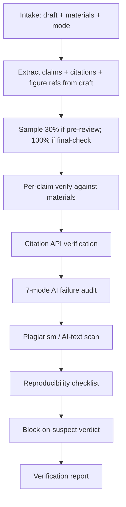

# integrity-check — AI/ML Paper Integrity Verifier

Block-on-suspect verification for AI/ML papers. Catches fabricated citations, unsupported claims, plagiarism, and the 7 known AI-research failure modes (Lu et al., 2026) before reviewers do.

## 30-Second Start

```
"Check the citations in this draft."
"Verify §4 claims against the experimental data."
"Run the 7-mode failure checklist on my paper."
"Audit reproducibility before I submit."
"对这份论文做完整性核查。"
```

## When to Use

| Use integrity-check when | Use a different skill when |
|---|---|
| You have a draft and want pre-submission audit | You're still drafting → `paper-writer` |
| You want citation verification | You need to find new citations → `lit-scout` |
| You want pre-flight check before reviewers see it | You want a peer review → `paper-reviewer` |

## Inputs

| Field | Required | Example |
|---|---|---|
| `draft` | yes | Path to .tex / .md / .docx |
| `materials` | yes | Bibliography + experimental data CSVs + method notes |
| `mode` | recommended | `pre-review` (30% sample) / `final-check` (100%) |
| `scope` | optional | `whole-paper` / `section: §4` / `claim-list: claims.txt` |

## Outputs

### 1. Per-Claim Verification Report

```yaml
claims:
  - id: claim-001
    location: "§4.2, paragraph 2, sentence 3"
    text: "Llama-3.1-70B achieves 91% on RULER 32K."
    status: verified | unsupported | unverifiable | contradicted
    evidence:
      - source: "results/long_context_eval.csv:row 14"
        confidence: high
    notes: ""

  - id: claim-007
    location: "§5, conclusion"
    text: "Our method outperforms all prior work on long-context retrieval."
    status: unsupported
    evidence: []
    notes: "No comparison to RULER baseline reported. Strengthen or weaken claim."
```

### 2. Citation Audit

```yaml
citations:
  total: 47
  verified: 43
  unverified: 2
  fabricated: 0
  hallucinated_arxiv_ids: 0
  failures:
    - bibkey: smith2024transformers
      issue: "DOI does not resolve"
    - bibkey: chen2025distractors
      issue: "Title in bib does not match Semantic Scholar record"
```

### 3. 7-Mode AI Failure Audit

Per [`academic-pipeline/references/ai_research_failure_modes.md`](../academic-pipeline/references/ai_research_failure_modes.md):

```yaml
failure_modes:
  - mode: 1_information_leakage
    status: pass | suspected | fail | insufficient
    notes: ""
  - mode: 2_data_contamination
    status: pass
  - mode: 3_evaluation_artifact
    status: suspected
    notes: "Eval set may overlap with training set used for the comparison baseline."
  - mode: 4_metric_manipulation
    status: pass
  - mode: 5_baseline_handicap
    status: insufficient
    notes: "Baseline hyperparameters not specified; cannot rule out under-tuning."
  - mode: 6_cherry_picked_qualitative
    status: pass
  - mode: 7_unfalsifiable_claim
    status: pass
```

### 4. Plagiarism / Self-Plagiarism / AI-Text Audit

Per [`academic-pipeline/references/plagiarism_detection_protocol.md`](../academic-pipeline/references/plagiarism_detection_protocol.md).

### 5. Reproducibility Checklist

Per `shared/venue_db/<venue>.yaml.reproducibility.checklist_url`. For NeurIPS, this is the Paper Checklist.

### 6. Block Verdict

```yaml
overall: PASS | BLOCK
blocking_issues:
  - "claim-007 unsupported"
  - "failure_mode 5_baseline_handicap insufficient evidence"
override_path: "Edit draft to address each blocking issue and re-run."
```

## Workflow



## Agents (delegated to existing v3 components)

| Agent | Role | File |
|---|---|---|
| `integrity_verification_agent` | Core verifier | [`academic-pipeline/agents/integrity_verification_agent.md`](../academic-pipeline/agents/integrity_verification_agent.md) |
| `source_verification_agent` | Citation API checks | [`deep-research/agents/source_verification_agent.md`](../deep-research/agents/source_verification_agent.md) |
| `citation_compliance_agent` | Style + bib coherence | [`academic-paper/agents/citation_compliance_agent.md`](../academic-paper/agents/citation_compliance_agent.md) |

## Key Protocols

- [`academic-pipeline/references/integrity_review_protocol.md`](../academic-pipeline/references/integrity_review_protocol.md) — 5-phase verification flow
- [`academic-pipeline/references/ai_research_failure_modes.md`](../academic-pipeline/references/ai_research_failure_modes.md) — 7-mode checklist
- [`academic-pipeline/references/claim_verification_protocol.md`](../academic-pipeline/references/claim_verification_protocol.md) — claim extraction
- [`academic-pipeline/references/plagiarism_detection_protocol.md`](../academic-pipeline/references/plagiarism_detection_protocol.md)
- [`shared/protocols/integrity_protocol.md`](../shared/protocols/integrity_protocol.md) — overview

## IRON RULES (block-on-suspect)

1. **Verdict BLOCK requires user action.** No `--no-block` escape. Override requires explicit logged reasoning in `outputs/integrity_override_log.md`.
2. **Claims with `status: unverifiable` are treated as `BLOCK`** in `final-check` mode, `WARN` in `pre-review` mode.
3. **Failure modes 1, 3, 5, 6 with `status: insufficient` are blocking** — these are the hardest to detect after publication.
4. **Citations with `fabricated` or `hallucinated_arxiv_ids` always BLOCK.** No override.
5. **Re-verify required after edits.** No "trust me, I fixed it" — re-run on the changed sections.

## Anti-Patterns

| # | Anti-Pattern | Correct Behavior |
|---|---|---|
| 1 | Sampling 30% but not noting which 30% | Log random seed + claim IDs sampled |
| 2 | Marking `verifiable in principle` as verified | Either verify or mark unverifiable |
| 3 | Skipping failure-mode audit because "we know our work" | Always run; calibration matters |
| 4 | Plagiarism check with low threshold to "pass" | Use protocol thresholds; surface flags honestly |
| 5 | Treating `insufficient evidence` as `pass` | These are different states; block on insufficient |

## Modes (lightweight)

| Mode | When | Coverage | Block behavior |
|---|---|---|---|
| `pre-review` | After draft, before sending to coauthors | 30% sample (min 10 claims) | Block: fix and re-verify, max 3 rounds |
| `final-check` | Before submission | 100% claims | Block: zero tolerance |

## Resume / Handoff

State persisted via `state_tracker`. Common handoffs:

- Verification failures → `paper-writer revise mode` (to fix in prose)
- Missing citations → `lit-scout` (to find them)
- Reproducibility gaps → `venue-formatter` (to fill checklist before submission)

## See Also

- `paper-writer` — drafts that go through this skill
- `lit-scout` — finds replacement citations for unverifiable ones
- `paper-reviewer` — invokes integrity-check as part of full review
- `rebuttal-coach` — invokes integrity-check before rebuttal claims about new experiments
- `academic-pipeline` (legacy) — full pipeline with mandatory integrity stages
