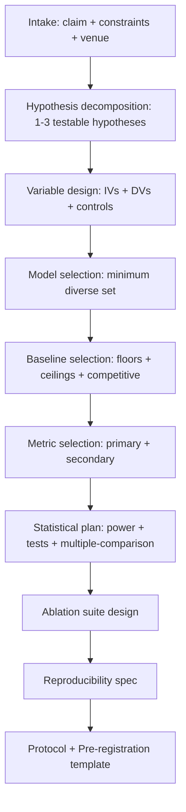

# method-architect — AI/ML Experimental Design

Design rigorous, falsifiable, reproducible experiments for an AI/ML claim. Output is a pre-registration-ready protocol.

## 30-Second Start

```
"Design an experiment to test that semantic-similarity of distractors degrades long-context accuracy."
"Plan the ablation suite for our diffusion-editing method."
"What baselines should I include for a long-context benchmark paper?"
"为我的 RLHF reward hacking 假设设计实验。"
```

## When to Use

| Use method-architect when | Use a different skill when |
|---|---|
| You have a claim and need to plan how to test it | You have results and need to write them up → `paper-writer` |
| You're choosing baselines and ablations | You need to find published methods to compare → `lit-scout` |
| You want to pre-register an experiment | You need to verify reproducibility of finished work → `integrity-check` |

## Inputs

| Field | Required | Example |
|---|---|---|
| `claim` | yes | "Semantic similarity of distractors degrades long-context accuracy by ≥30% at sim≥0.7" |
| `constraints` | yes | Compute, time, data access (re-use idea-forge constraints if available) |
| `existing_baselines` | recommended | Methods you know you should compare against |
| `target_venue` | optional | Drives experimental rigor expectations |
| `prior_results` | optional | What you already have (if extending a project) |

## Outputs

### 1. Experimental Protocol

```yaml
hypotheses:
  - id: h1
    statement: "Accuracy decreases as distractor-needle cosine similarity increases."
    direction: monotonic-decreasing
    falsification: "If accuracy is constant or non-monotonic across similarity buckets."
    expected_effect_size: "≥30% gap between sim=0.3 and sim=0.9"

conditions:
  independent_variables:
    - name: distractor_similarity
      values: [0.3, 0.5, 0.7, 0.9]
  fixed_variables:
    - name: needle_position
      value: "context-middle, ±10%"
    - name: context_length
      value: "32K"
  controls:
    - name: positional_control
      description: "Vary needle position with similarity fixed at baseline 0.3"
      purpose: "Rule out positional confound"

models:
  - name: Llama-3.1-70B-Instruct
    why_included: "Open-weight SOTA long-context"
  - name: Qwen2.5-72B-Instruct
    why_included: "Different architecture family"
  - name: GPT-4o
    why_included: "Closed model reference"

baselines:
  - name: Random distractor selection
    purpose: "Lower bound on the distractor-confusion effect"
  - name: Anti-correlated distractors (sim<0)
    purpose: "Upper bound — easiest case"
  - name: Retrieval-based (BM25 + answer)
    purpose: "Decouple long-context behavior from raw retrieval"

metrics:
  primary:
    - name: needle_recall_accuracy
      definition: <precise>
  secondary:
    - name: calibration_ECE
    - name: per-bucket-confidence-distribution
```

### 2. Statistical Analysis Plan

```yaml
sample_size_justification: <power calculation or pre-existing benchmark size>
test:
  - name: trend_test
    test: spearman_rank_correlation
    H0: "rho=0"
    alpha: 0.05
multiple_comparisons: bonferroni  # or none, holm, fdr
seed_protocol: "5 seeds; report mean ± std"
```

### 3. Ablation Plan

```yaml
ablations:
  - id: abl-001
    target: distractor_similarity_metric
    description: "Try L2 distance instead of cosine."
    purpose: "Robustness to similarity definition."
    estimated_compute: 4 GPU-hours
```

### 4. Reproducibility Spec

```yaml
reproducibility:
  data: "Public — needle pool from RULER, distractors filtered by sentence-transformers."
  code: "Will release at github.com/<placeholder>"
  random_seeds: [42, 123, 456, 789, 1024]
  hardware: "8× H100 80GB"
  software: "PyTorch 2.5, transformers 4.50, vllm 0.7"
  expected_runtime: "~80 GPU-hours total"
```

## Workflow



## Agents (delegated to existing v3 components)

| Agent | Role | File |
|---|---|---|
| `research_architect_agent` | Core experimental design | [`archive/v3/deep-research/agents/research_architect_agent.md`](../archive/v3/deep-research/agents/research_architect_agent.md) |
| `risk_of_bias_agent` | Identify confounds and biases | [`archive/v3/deep-research/agents/risk_of_bias_agent.md`](../archive/v3/deep-research/agents/risk_of_bias_agent.md) |
| `devils_advocate` (shared) | Stress test the protocol | [`shared/agents/devils_advocate.md`](../shared/agents/devils_advocate.md) |

## IRON RULES

1. **Every hypothesis must have a falsification criterion.** If the experiment cannot fail, it cannot succeed either.
2. **Every IV needs at least one control.** Confounds must be explicitly named and ruled out by design.
3. **Baselines include floor + ceiling**, not just "competitive method". Floor (worst plausible) and ceiling (oracle) bound the result.
4. **Statistical plan committed before running.** No post-hoc test selection.
5. **Compute budget must be in `constraints`.** Plan that exceeds budget by >2x is reduced or flagged.

## Anti-Patterns

| # | Anti-Pattern | Correct Behavior |
|---|---|---|
| 1 | "We will explore X, Y, Z" without committing to claims | Pick one claim per experiment; add others as ablations |
| 2 | "We compare to all major baselines" — vague | List each baseline by name with rationale |
| 3 | Single seed evaluation | ≥3 seeds for empirical claims |
| 4 | Choosing metrics post-hoc to look good | Pre-register primary metric |
| 5 | Skipping ablation on the central design choice | If method has component X, ablate X |
| 6 | "Standard hyperparameters" without specifying | Specify them; or specify the search procedure |

## See Also

- `idea-forge` — generates the claim
- `lit-scout` — finds the baselines you should consider
- `integrity-check` — verifies the experiment was actually run
- `deep-research` (legacy) — methodology design root agents
