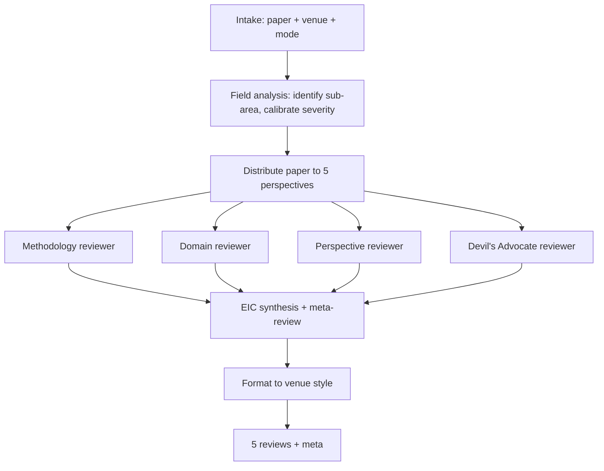

# paper-reviewer — AI Venue Multi-Perspective Reviewer

Simulate a realistic AI venue peer review (NeurIPS / ICLR / ICML / ACL / EMNLP / CVPR / AAAI). Five independent reviewer perspectives + an editor-in-chief synthesis, all in the venue's required review format.

## 30-Second Start

```
"Review my paper for NeurIPS."
"Run an OpenReview-style review on this draft."
"What would ACL reviewers say about this paper?"
"Give me a tough Devil's Advocate review."
"Re-review after my revisions."
"为我的论文做 ICLR 同行评审。"
```

## When to Use

| Use paper-reviewer when | Use a different skill when |
|---|---|
| You want pre-submission review simulation | You have actual reviews to respond to → `rebuttal-coach` |
| You want venue-format scoring | You want quick fact-check → `integrity-check` |
| You want adversarial critique | You want positive feedback (don't — use a coauthor) |

## Inputs

| Field | Required | Example |
|---|---|---|
| `paper` | yes | Path to draft (.tex / .md / .pdf) |
| `venue` | yes | Tag from `shared/venue_db/` — drives review format and scoring scale |
| `mode` | recommended | `full` (5 reviewers) / `quick` (Methodology + DA only) / `methodology-focus` / `re-review` |
| `prior_review` | optional | If `mode: re-review`, the previous review report |
| `prior_revision` | optional | If `mode: re-review`, the revision response |

## Outputs

Five reviewer reports + EIC synthesis, formatted per venue:

### NeurIPS / ICML / AAAI Format

```yaml
- reviewer_id: r1_methodology
  perspective: methodology
  scores:
    soundness: <1-4>
    presentation: <1-4>
    contribution: <1-4>
    overall: <1-10>
    confidence: <1-5>
  summary: <1 paragraph>
  strengths: [...]
  weaknesses: [...]
  questions: [...]
  limitations: <discussion>
  ethics: <flags or "no concerns">
  recommendation: <strong-accept|accept|borderline|reject|strong-reject>
```

### ICLR Format

OpenReview format with discussion threading hints (rebuttal-coach friendly).

### ACL / EMNLP Format

```yaml
- paper_summary: <2 paragraphs>
  summary_of_strengths: [...]
  summary_of_weaknesses: [...]
  comments_suggestions_typos: [...]
  soundness: <1-5>
  excitement: <1-5>
  reproducibility: <1-5>
  ethical_concerns: <flags or "none">
  reviewer_confidence: <1-5>
  overall_recommendation: <1-5>
```

### CVPR Format

```yaml
- summary: <1 paragraph>
  strengths: [...]
  weaknesses: [...]
  rating: <1-5>
  confidence: <1-5>
```

### Meta-Review (EIC)

Produced by `eic_agent`. Synthesizes the 5 perspectives into a recommendation and identifies the 1-3 issues most likely to drive the final decision.

## Workflow



## Agents (delegated to existing v3 components)

| Agent | Role | File |
|---|---|---|
| `field_analyst_agent` | Identify sub-area, calibrate severity | [`archive/v3/academic-paper-reviewer/agents/field_analyst_agent.md`](../archive/v3/academic-paper-reviewer/agents/field_analyst_agent.md) |
| `methodology_reviewer_agent` | Methods rigor | [`archive/v3/academic-paper-reviewer/agents/methodology_reviewer_agent.md`](../archive/v3/academic-paper-reviewer/agents/methodology_reviewer_agent.md) |
| `domain_reviewer_agent` | Sub-field expertise | [`archive/v3/academic-paper-reviewer/agents/domain_reviewer_agent.md`](../archive/v3/academic-paper-reviewer/agents/domain_reviewer_agent.md) |
| `perspective_reviewer_agent` | Underrepresented angle (e.g., applied / theoretical) | [`archive/v3/academic-paper-reviewer/agents/perspective_reviewer_agent.md`](../archive/v3/academic-paper-reviewer/agents/perspective_reviewer_agent.md) |
| `devils_advocate` (shared) | Adversarial critique | [`shared/agents/devils_advocate.md`](../shared/agents/devils_advocate.md) |
| `eic_agent` | EIC synthesis | [`archive/v3/academic-paper-reviewer/agents/eic_agent.md`](../archive/v3/academic-paper-reviewer/agents/eic_agent.md) |
| `editorial_synthesizer_agent` | Final meta-review compilation | [`archive/v3/academic-paper-reviewer/agents/editorial_synthesizer_agent.md`](../archive/v3/academic-paper-reviewer/agents/editorial_synthesizer_agent.md) |

## IRON RULES

1. **Anti-sycophancy applies** per [`shared/protocols/anti_sycophancy.md`](../shared/protocols/anti_sycophancy.md). Reviewers do NOT concede to author defense unless score ≥4/5.
2. **5 perspectives must be independent.** Same agent context cannot bleed across reviewers.
3. **Devil's Advocate cannot be skipped** in `full` mode.
4. **Format must match venue** — NeurIPS scores look different from ACL scores.
5. **Reviewer scores cannot all be the same.** Reviewers disagree in real life; if your simulated reviewers all give 7/10, calibration is off.
6. **Block if integrity-check finds critical issues.** Optionally, paper-reviewer auto-invokes integrity-check before review.

## Anti-Patterns

| # | Anti-Pattern | Correct Behavior |
|---|---|---|
| 1 | Generic "needs more experiments" feedback | Specify which experiment and what it would show |
| 2 | All reviewers agreeing on everything | Independent perspectives by design |
| 3 | Reviewer that only highlights strengths | Real reviews surface weaknesses too — fix the prompt |
| 4 | Devil's Advocate that picks small typos | DA hunts paper-killing issues, not minor edits |
| 5 | Score inflation (everything is 8/10) | Use venue's actual score distribution |
| 6 | Skipping ethics/limitations sections | Many venues now require these — auditor enforces |

## Modes (lightweight)

| Mode | When | Behavior |
|---|---|---|
| `full` | default | 5 reviewers + EIC |
| `quick` | "quick review" | Methodology + DA only |
| `methodology-focus` | user wants rigor check | Methodology reviewer + integrity-check |
| `re-review` | `prior_review` provided | Verify revision addresses prior concerns |
| `calibration` | user wants accuracy comparison | Run review, then user provides actual reviews; agent reports calibration delta |

## Re-Review Protocol

When `mode: re-review`:
1. Read prior_review's blocking concerns
2. Locate revision_plan items addressing them
3. Verify each prior concern: addressed | partially addressed | unaddressed
4. Re-score; track score delta vs prior review
5. If score delta is positive AND blocking concerns addressed, recommend acceptance bump

## Resume / Handoff

- Review reports → `rebuttal-coach` (when actual reviews come in, predict overlap)
- Critical concerns → `paper-writer revise mode` (to address)
- Reviewer-threat patterns → `paper-writer` (preempt in next draft)

## See Also

- `integrity-check` — invoked before review for fact-finding
- `rebuttal-coach` — when actual review arrives
- `academic-paper-reviewer` (legacy) — root reviewer machinery
- `shared/protocols/anti_sycophancy.md`
- `shared/venue_db/` — venue review formats
