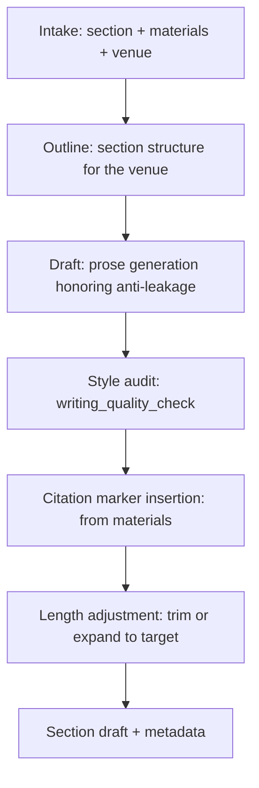

# paper-writer — AI/ML Paper Section Drafter

Write paper sections that survive AI venue review. Specialized for the AI/ML structure (Method-Experiments-Related Work-Discussion) with anti-leakage protocol to prevent LLM-introduced fabrications.

## 30-Second Start

```
"Draft the Method section. Notes at method.md, results at results.csv."
"Write the abstract for the long-context similarity paper, ICLR style."
"Polish the Experiments section — currently 850 words, target 600."
"Revise §3 to address Reviewer 2's clarity concern."
"为我的论文写引言部分，重点对比 RULER 和 LongBench v2。"
```

## When to Use

| Use paper-writer when | Use a different skill when |
|---|---|
| You're drafting paper sections | You're writing a rebuttal → `rebuttal-coach` |
| You need an abstract or intro | You need to design the experiment first → `method-architect` |
| You're polishing/revising prose | You need a full peer review → `paper-reviewer` |

## Inputs

| Field | Required | Example |
|---|---|---|
| `section` | yes | `abstract` / `intro` / `method` / `experiments` / `related-work` / `discussion` / `conclusion` |
| `materials` | yes | Notes, CSVs, results tables, prior drafts (any combination) |
| `venue` | recommended | Tag for style; lookup `shared/venue_db/` |
| `target_word_count` | recommended | Defaults to venue norms |
| `tone` | optional | `academic` (default) / `accessible` / `crisp` |
| `language` | optional | `en` (default) / `bilingual-en-zh` (writes EN, generates ZH abstract) |
| `existing_draft` | optional | If revising rather than drafting from scratch |

## Outputs

### Section Draft

Markdown with proper citation placeholders (`\cite{key}` or `[author, year]`). Honors:
- Venue word/page conventions (`shared/venue_db/`)
- Style anti-patterns (`references/writing_quality_check.md`)
- Anti-leakage protocol (no fabricated facts/citations)

### Section Metadata

```yaml
draft_metadata:
  section: method
  word_count: 612
  target_word_count: 600
  citations_used: [<bibkey1>, <bibkey2>]
  citations_pending_verification: [<bibkey3>]
  figure_refs: [fig:1, fig:2]
  table_refs: [tab:1]
  anti_leakage_audit:
    factual_claims_made: 14
    factual_claims_with_source: 14
    style_violations: 0
```

### (Optional) Bilingual Abstract

If `language: bilingual-en-zh`, also produces a Chinese abstract using the bilingual abstract agent.

## Workflow



## Agents (delegated to existing v3 components)

| Agent | Role | File |
|---|---|---|
| `draft_writer_agent` | Core section drafting | [`academic-paper/agents/draft_writer_agent.md`](../academic-paper/agents/draft_writer_agent.md) |
| `revision_coach_agent` | Revision-mode prose editing | [`academic-paper/agents/revision_coach_agent.md`](../academic-paper/agents/revision_coach_agent.md) |
| `abstract_bilingual_agent` | Optional bilingual abstract | [`academic-paper/agents/abstract_bilingual_agent.md`](../academic-paper/agents/abstract_bilingual_agent.md) |
| `argument_builder_agent` | Discussion / Conclusion structuring | [`academic-paper/agents/argument_builder_agent.md`](../academic-paper/agents/argument_builder_agent.md) |
| `structure_architect_agent` | Outline / re-organization | [`academic-paper/agents/structure_architect_agent.md`](../academic-paper/agents/structure_architect_agent.md) |
| `socratic_mentor` (shared) | Plan-mode chapter dialogue | [`shared/agents/socratic_mentor.md`](../shared/agents/socratic_mentor.md) |

## Key Protocols

- [`academic-paper/references/anti_leakage_protocol.md`](../academic-paper/references/anti_leakage_protocol.md) — IRON RULE: only cite facts present in `materials`
- [`academic-paper/references/writing_quality_check.md`](../academic-paper/references/writing_quality_check.md) — anti-pattern lint
- [`academic-paper/references/style_calibration.md`](../academic-paper/references/style_calibration.md) — voice matching to existing draft
- [`shared/venue_db/<venue>.yaml`](../shared/venue_db/) — venue-specific length and structure

## IRON RULES (from anti_leakage_protocol.md)

1. **Knowledge isolation:** No claim, number, or citation in the draft that is not present in `materials`. The model writes prose; it does not invent facts.
2. **Citations are markers, not invented references.** Use `\cite{key}` placeholders matching `materials.bibliography`. If no key exists, mark `\cite{TODO_<topic>}` and surface in metadata.
3. **No "delve into", no "crucial", no "it is important to note".** See writing_quality_check.md for the full forbidden phrase list.
4. **Word count within ±10% of `target_word_count`.** Beyond that, length adjustment is mandatory.
5. **Style match to existing draft if `existing_draft` provided.** Run style_calibration.md.

## Anti-Patterns

| # | Anti-Pattern | Correct Behavior |
|---|---|---|
| 1 | Inventing experimental numbers | Use placeholders; require user to fill from materials |
| 2 | "Existing literature shows X" without citation | Mark TODO citation or remove the claim |
| 3 | "We achieve state-of-the-art" without context | Specify the benchmark and the magnitude |
| 4 | Voice shift mid-paragraph | Style audit; rewrite to match existing draft |
| 5 | Burying the contribution in paragraph 4 of intro | Lead the intro with the contribution sentence |
| 6 | Bullet lists in main text | Use prose; bullets only for enumerable items (e.g., contributions) |

## Modes (lightweight, auto-detected)

| Mode | When auto-engaged | Behavior |
|---|---|---|
| `draft` | default | Section draft from materials |
| `revise` | `existing_draft` provided | Edit existing prose to address issue |
| `polish` | `existing_draft` + tone adjustment requested | Style-only changes |
| `outline` | section without materials, user wants structure first | Outline + Socratic dialogue |
| `abstract-bilingual` | `language: bilingual-en-zh` and `section: abstract` | EN + ZH abstract |

## Resume / Handoff

State persisted via `state_tracker`. Common handoffs:

- Draft → `figure-smith` (when section references figures that don't exist yet)
- Draft → `integrity-check` (verify citation and factual claims)
- Draft → `venue-formatter` (compile to LaTeX + venue template)
- Draft → `paper-reviewer` (self-review before sending to coauthors)

## See Also

- `lit-scout` — supplies bibliography for citations
- `related-positioning` — supplies related-work section content
- `figure-smith` — supplies figures referenced by the prose
- `integrity-check` — verifies the draft post-hoc
- `venue-formatter` — final compile to venue style
- `academic-paper` (legacy) — underlying agent machinery
