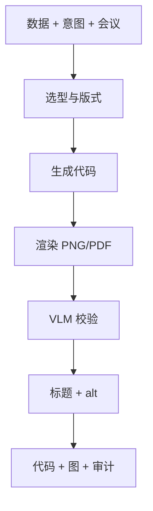

# ai-figure-smith — AI/ML 论文图表工坊

生成**准确、可访问、符合会议规范**的图表；内置 **VLM 校验**（在审稿人之前发现渲染问题）。

## 30 秒上手

```
"Plot accuracy vs distractor similarity, 4 models, error bars."
"Make the ablation table for §4. Data at ablation.csv."
"为我的实验结果做一张配图，柱状图，4个 baseline。"
```

## 何时使用

| 使用 ai-figure-smith | 换用其他 skill |
|---|---|
| 有数据需出版级配图 | 仅需数据分析 → 外部工具 |
| 写标题与 alt 文本 | 正文段落 → `ai-paper-writer` |
| 对已有图做 VLM 校验 | 全文完整性 → `ai-integrity-check` |

## 输出

作图代码、标题 YAML、alt 文本、VLM 审计报告 — 结构同英文版。

## 工作流



## Agent

| Agent | 文件 |
|---|---|
| `visualization_agent` | [`../../shared/agents/visualization_agent.md`](../../shared/agents/visualization_agent.md) |

## 协议

- [`../../shared/references/vlm_figure_verification.md`](../../shared/references/vlm_figure_verification.md)  
- [`../../shared/references/statistical_visualization_standards.md`](../../shared/references/statistical_visualization_standards.md)  
- [`../../shared/venue_db/`](../../shared/venue_db/)

## 铁律

1. **可复现代码**，非纯生成图。  
2. **默认执行 VLM 校验**；跳过须会话内显式选择退出。  
3. 图中数字须来自 `data`。  
4. **默认可读色盲安全配色**。  
5. 无障碍：**alt 文本**在 ACL 等必选，其余强烈推荐。

## 参见

`ai-paper-writer`、`ai-venue-formatter`、`ai-integrity-check`。
