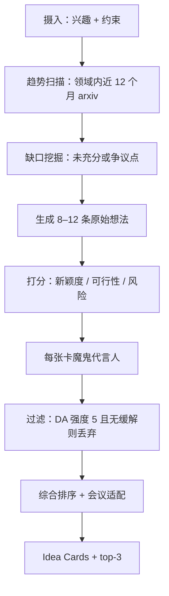

# ai-idea-forge — AI/ML 研究想法生成器

将模糊兴趣转化为**可检验、带新颖度评分**的研究想法列表，并给出最小可行实验。面向投稿 NeurIPS / ICLR / ICML / ACL / EMNLP 的 AI/ML 研究者。

## 30 秒上手

```
"Give me ideas on long-context LLM evaluation. I have 8 H100s for 2 months."
"Brainstorm research directions in mechanistic interpretability for diffusion models."
"想几个 RLHF reward hacking 方向的 idea，3 个月时间，没有 GPU 集群。"
```

你将得到 5–10 张 **Idea Card**，排序展示，并高亮前 3 名。

## 何时使用

| 使用 ai-idea-forge | 换用其他 skill |
|---|---|
| 有兴趣方向但尚无具体研究问题 | 已有 RQ → `ai-lit-scout` |
| 想估计相对已有工作的新颖度 | 要与具体论文对比定位 → `ai-related-positioning` |
| 需要在多个方向间取舍 | 已准备设计实验 → `ai-method-architect` |

## 输入

| 字段 | 必填 | 示例 |
|---|---|---|
| `interest_area` | 是 | "long-context LLM evaluation" |
| `constraints.compute` | 是 | "8 H100s, 2 months" |
| `constraints.data_access` | 是 | "public datasets only" |
| `constraints.timeline` | 建议 | "submit to ICLR 2027 (deadline late Sept)" |
| `target_venues` | 建议 | `[neurips, iclr]`（查 `../../shared/venue_db/`） |
| `existing_reads` | 可选 | 你已读文献列表 |
| `style_preference` | 可选 | `theoretical` / `empirical` / `applied` / `position-paper` |

## 输出

YAML + Markdown 包；结构见英文版 schema（`one_line_claim`、`novelty_score`、`feasibility_score`、`risk_score`、`minimum_experiment`、`devils_advocate` 等）。人类可读摘要并行生成。

## 工作流



## Agents

| Agent | 角色 | 文件 |
|---|---|---|
| `idea_intake_agent` | 轻量访谈（≤4 问） | [`../../ai-idea-forge/agents/idea_intake_agent.md`](../../ai-idea-forge/agents/idea_intake_agent.md) |
| `trend_scanner_agent` | WebSearch 拉取近期趋势 | [`../../ai-idea-forge/agents/trend_scanner_agent.md`](../../ai-idea-forge/agents/trend_scanner_agent.md) |
| `gap_miner_agent` | 识别未充分交叉点 | [`../../ai-idea-forge/agents/gap_miner_agent.md`](../../ai-idea-forge/agents/gap_miner_agent.md) |
| `idea_generator_agent` | 组合 Idea Card | [`../../ai-idea-forge/agents/idea_generator_agent.md`](../../ai-idea-forge/agents/idea_generator_agent.md) |
| `novelty_scorer_agent` | 相对已知工作打分 | [`../../ai-idea-forge/agents/novelty_scorer_agent.md`](../../ai-idea-forge/agents/novelty_scorer_agent.md) |
| `devils_advocate`（共享） | 压力测试 | [`../../shared/agents/devils_advocate.md`](../../shared/agents/devils_advocate.md) |
| `socratic_mentor`（共享） | 用户犹豫时 | [`../../shared/agents/socratic_mentor.md`](../../shared/agents/socratic_mentor.md) |

## 铁律

1. **禁止伪造引用**：每条「最接近已有工作」须可通过 WebSearch 或 Semantic Scholar 核验；不确定则标 `unverified` 并询问用户。
2. **魔鬼代言人不可跳过**：每张卡必有 DA 批评与强度分；强度 5 且无缓解的条目过滤掉，不保留。
3. **约束是硬条件**：若用户给出算力/时间，每张卡的 `estimated_compute` 必须可落地；超标则删或缩小范围。
4. **宁少勿滥**：5 个尖锐想法优于 20 个空泛想法。
5. **会议适配仅供参考**：可标注适合哪些会，但不因「不适合任何会」而拒绝想法——可注明「仅预印本」。

## 恢复与交接

会话持久化见 [`../../shared/agents/state_tracker.md`](../../shared/agents/state_tracker.md)。

选定想法后：`ai-lit-scout` → `ai-related-positioning` → `ai-method-architect`。

## 参考

- [`../../ai-idea-forge/references/novelty_taxonomy.md`](../../ai-idea-forge/references/novelty_taxonomy.md)
- [`../../ai-idea-forge/references/feasibility_rubric.md`](../../ai-idea-forge/references/feasibility_rubric.md)
- [`../../ai-idea-forge/references/idea_anti_patterns.md`](../../ai-idea-forge/references/idea_anti_patterns.md)
- [`../../ai-idea-forge/templates/idea_card.yaml`](../../ai-idea-forge/templates/idea_card.yaml)
- [`../../ai-idea-forge/examples/long_context_eval_session.md`](../../ai-idea-forge/examples/long_context_eval_session.md)
