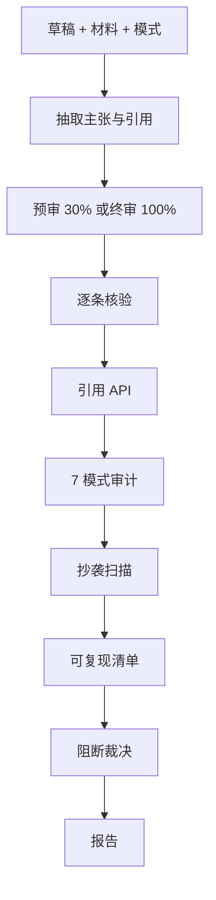

# ai-integrity-check — AI/ML 论文完整性核验

**疑似即阻断**：在审稿人之前拦截伪造引用、无证据主张、抄袭及 Lu et al.（2026）总结的 **7 类 AI 研究失败模式**。

## 30 秒上手

```
"Check the citations in this draft."
"Verify §4 claims against the experimental data."
"Run the 7-mode failure checklist on my paper."
"对这份论文做完整性核查。"
```

## 何时使用

| 使用 ai-integrity-check | 换用其他 skill |
|---|---|
| 有草稿需投稿前审计 | 仍在起草 → `ai-paper-writer` |
| 核验引用 | 需新文献 → `ai-lit-scout` |
| 投稿前自检 | 模拟同行评议 → `ai-paper-reviewer` |

## 输出概要

逐条主张报告、引用审计、**7 模式失败审计**、抄袭/AI 文本审计、可复现性清单、**PASS/BLOCK 总 verdict** — YAML 结构同英文版。

## 工作流



## Agents（复用 v3）

| Agent | 文件 |
|---|---|
| `integrity_verification_agent` | [`../../archive/v3/academic-pipeline/agents/integrity_verification_agent.md`](../../archive/v3/academic-pipeline/agents/integrity_verification_agent.md) |
| `source_verification_agent` | [`../../archive/v3/deep-research/agents/source_verification_agent.md`](../../archive/v3/deep-research/agents/source_verification_agent.md) |
| `citation_compliance_agent` | [`../../archive/v3/academic-paper/agents/citation_compliance_agent.md`](../../archive/v3/academic-paper/agents/citation_compliance_agent.md) |

## 关键协议

- [`../../archive/v3/academic-pipeline/references/ai_research_failure_modes.md`](../../archive/v3/academic-pipeline/references/ai_research_failure_modes.md)  
- [`../../archive/v3/academic-pipeline/references/integrity_review_protocol.md`](../../archive/v3/academic-pipeline/references/integrity_review_protocol.md)  
- [`../../shared/protocols/integrity_protocol.md`](../../shared/protocols/integrity_protocol.md)

## 铁律（疑似即阻断）

1. **BLOCK 须用户处理**；无 `--no-block` 捷径。  
2. `pre-review` 与 `final-check` 对 `unverifiable` 处理不同。  
3. 失败模式 1/3/5/6 的 `insufficient` 可阻断。  
4. **伪造引用或幻觉 arXiv ID 一律 BLOCK**。  
5. 修改后须**重新核验**。

## 模式

`pre-review`（约 30% 抽样）与 `final-check`（100%）。

## 参见

`ai-paper-writer`、`ai-lit-scout`、`ai-paper-reviewer`、`ai-rebuttal-coach`。
