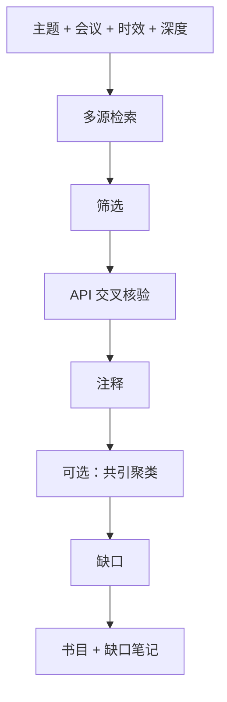

# ai-lit-scout — AI/ML 文献侦察

查找、核验并注释你需要引用的文献。面向 AI/ML（arxiv 文化、Semantic Scholar、趋势迭代快）。

## 30 秒上手

```
"Find recent literature on long-context LLM evaluation since 2024."
"Build a bibliography for diffusion editing methods, ICLR/CVPR papers."
"Verify these 12 citations and add 5 missing key papers."
"做一份 mechanistic interpretability 的文献综述，2025 年以来。"
```

## 何时使用

| 使用 ai-lit-scout | 换用其他 skill |
|---|---|
| 需要领域内找论文 | 已有论文需差异化定位 → `ai-related-positioning` |
| 需要为草稿准备可核验引用 | 已有草稿需查引用 → `ai-integrity-check` |
| 需要带注释书目 | 需写 Related Work 正文 → `ai-related-positioning` |

## 输入与输出

字段与 YAML 输出 schema 与英文版一致（`annotated bibliography`、`citation graph`、`gap notes`）。深度：`quick` / `standard` / `comprehensive`。

## 工作流



## Agents（复用 v3）

| Agent | 角色 | 文件 |
|---|---|---|
| `bibliography_agent` | 多源检索与注释 | [`../../archive/v3/deep-research/agents/bibliography_agent.md`](../../archive/v3/deep-research/agents/bibliography_agent.md) |
| `source_verification_agent` | 标题/DOI/被引数核验 | [`../../archive/v3/deep-research/agents/source_verification_agent.md`](../../archive/v3/deep-research/agents/source_verification_agent.md) |
| `socratic_mentor`（共享） | 主题过宽时 | [`../../shared/agents/socratic_mentor.md`](../../shared/agents/socratic_mentor.md) |

## 关键协议

- [`../../archive/v3/deep-research/references/semantic_scholar_api_protocol.md`](../../archive/v3/deep-research/references/semantic_scholar_api_protocol.md)
- [`../../archive/v3/deep-research/references/cross_agent_quality_definitions.md`](../../archive/v3/deep-research/references/cross_agent_quality_definitions.md)
- [`../../shared/protocols/integrity_protocol.md`](../../shared/protocols/integrity_protocol.md)

## 铁律

1. **禁止伪造引用**；每条须 API 核验或明确标注未核验原因。  
2. **标题须逐字**来自源。  
3. **被引数须来自 API**，禁止估算。  
4. **注释至少基于摘要**，禁止臆造论文主张。  
5. **arXiv ID** 格式与可解析性检查。

## 模式（轻量、自动）

`quick` / `standard` / `comprehensive` / `verify-existing` — 由输入自动推断，用户无需显式声明。

## 交接

带注释书目 → `ai-related-positioning`、`ai-paper-writer`；缺口笔记 → `ai-idea-forge`。
