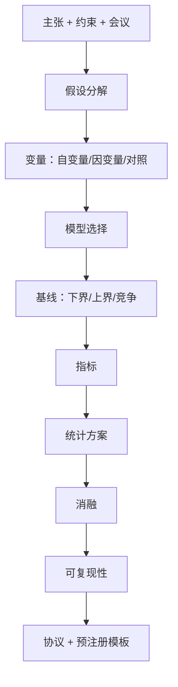

# ai-method-architect — AI/ML 实验设计

为 AI/ML 主张设计**可证伪、可复现**的实验；输出接近预注册水平的协议。

## 30 秒上手

```
"Design an experiment to test that semantic-similarity of distractors degrades long-context accuracy."
"Plan the ablation suite for our diffusion-editing method."
"What baselines should I include for a long-context benchmark paper?"
"为我的 RLHF reward hacking 假设设计实验。"
```

## 何时使用

| 使用 ai-method-architect | 换用其他 skill |
|---|---|
| 有主张需规划如何检验 | 已有结果需撰写 → `ai-paper-writer` |
| 选择基线与消融 | 需检索已发表方法 → `ai-lit-scout` |
| 预注册式实验设计 | 已完成工作可复现性审计 → `ai-integrity-check` |

## 输出

实验协议、统计分析计划、消融计划、可复现性说明 — YAML 结构与英文版一致。

## 工作流



## Agents（`shared/agents`）

| Agent | 角色 | 文件 |
|---|---|---|
| `research_architect_agent` | 核心实验设计 | [`../../shared/agents/research_architect_agent.md`](../../shared/agents/research_architect_agent.md) |
| `risk_of_bias_agent` | 混杂与偏倚 | [`../../shared/agents/risk_of_bias_agent.md`](../../shared/agents/risk_of_bias_agent.md) |
| `devils_advocate`（共享） | 协议压力测试 | [`../../shared/agents/devils_advocate.md`](../../shared/agents/devils_advocate.md) |

## 铁律

1. 每个假设须有**可证伪标准**。  
2. 每个自变量须有**对照**以排除混杂。  
3. 基线须含**下界+上界**，非仅 SOTA。  
4. **统计方案先于跑实验**确定。  
5. 算力预算须在约束内；超预算 >2× 须缩减或标注。

## 参见

`ai-idea-forge`、`ai-lit-scout`、`ai-integrity-check`。
