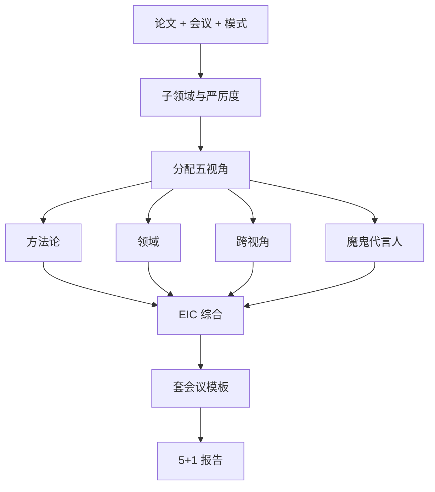

# ai-paper-reviewer — AI 会议多视角模拟审稿

模拟 **NeurIPS / ICLR / ICML / ACL / EMNLP / CVPR / AAAI** 等风格的同行评议：五路独立视角 + 主编综合，格式与评分量表按会议要求。

## 30 秒上手

```
"Review my paper for NeurIPS."
"Run an OpenReview-style review on this draft."
"为我的论文做 ICLR 同行评审。"
```

## 何时使用

| 使用 ai-paper-reviewer | 换用其他 skill |
|---|---|
| 投稿前模拟审稿 | 已有真实意见需回复 → `ai-rebuttal-coach` |
| 需要会议格式打分 | 快速事实核对 → `ai-integrity-check` |
| 需要对抗性批评 | 寻求一味表扬 → 请找合作者 |

## 输出

五份报告 + EIC 元综述；NeurIPS/ICLR/ACL/CVPR 等 YAML 结构见英文版。

## 工作流



## Agents（`shared/agents`）

路径均指向 [`../../shared/agents/`](../../shared/agents/)（含各 reviewer agent 与 [`../../shared/agents/devils_advocate.md`](../../shared/agents/devils_advocate.md)）。

## 铁律

1. **反谄媚协议**见 [`../../shared/protocols/anti_sycophancy.md`](../../shared/protocols/anti_sycophancy.md)。  
2. **五视角须独立**，上下文不得串线。  
3. `full` 模式**不可跳过**魔鬼代言人。  
4. **格式须符合会议**。  
5. 模拟分数不应全部相同；必要时可先跑 `ai-integrity-check`。

## 模式

`full` / `quick` / `methodology-focus` / `re-review` / `calibration` — 见英文版。

## 参见

`ai-integrity-check`、`ai-rebuttal-coach`、`ai-paper-writer`。
