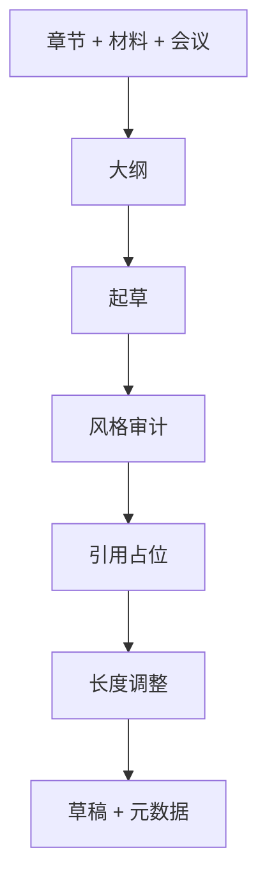

# ai-paper-writer — AI/ML 论文章节起草

撰写能通过 AI 会议审稿的章节；结构偏向 Method–Experiments–Related Work–Discussion；**防泄漏协议**避免模型捏造事实/引用。

## 30 秒上手

```
"Draft the Method section. Notes at method.md, results at results.csv."
"Write the abstract for the long-context similarity paper, ICLR style."
"Polish the Experiments section — currently 850 words, target 600."
"为我的论文写引言部分，重点对比 RULER 和 LongBench v2。"
```

## 何时使用

| 使用 ai-paper-writer | 换用其他 skill |
|---|---|
| 起草论文章节 | 写 rebuttal → `ai-rebuttal-coach` |
| 需要摘要/引言 | 需先设计实验 → `ai-method-architect` |
| 润色/修订文笔 | 需要完整模拟审稿 → `ai-paper-reviewer` |

## 输入

`section`、`materials`、`venue`、`target_word_count`、`tone`、`language`（含 `bilingual-en-zh`）、`existing_draft` 等 — 与英文版一致。

## 工作流



## Agents（`shared/agents`）

见英文版表格：`draft_writer_agent`、`revision_coach_agent`、`abstract_bilingual_agent`、`argument_builder_agent`、`structure_architect_agent`、`socratic_mentor`。路径前缀：`../../shared/agents/`。

## 关键协议

- [`../../shared/references/anti_leakage_protocol.md`](../../shared/references/anti_leakage_protocol.md) — **铁律**：材料中无则文中无。  
- [`../../shared/references/writing_quality_check.md`](../../shared/references/writing_quality_check.md)  
- [`../../shared/references/academic_writing_style.md`](../../shared/references/academic_writing_style.md)  
- [`../../shared/venue_db/`](../../shared/venue_db/)

## 模式

`draft` / `revise` / `polish` / `outline` / `abstract-bilingual` — 自动检测。

## 交接

→ `ai-figure-smith`、`ai-integrity-check`、`ai-venue-formatter`、`ai-paper-reviewer`。
