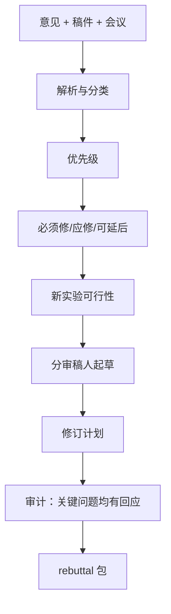

# ai-rebuttal-coach — AI 会议 Rebuttal 助手

在 OpenReview 类会议（ICLR、NeurIPS）及 ACL/CVPR 等字数受限场景中，**作者回复**往往显著影响分数。本 skill 产出**排序清晰、符合字数**的 rebuttal 草案与修订计划。

## 30 秒上手

```
"Help me rebut these NeurIPS reviews: [paste]"
"Write the ICLR author response. Manuscript at paper.tex."
"为这份 ICML 审查意见写 rebuttal，5000 字限制。"
```

## 何时使用

| 使用 ai-rebuttal-coach | 换用其他 skill |
|---|---|
| 已有真实审稿意见 | 投稿前自评 → `ai-paper-reviewer` |
| 受会议字数/页数限制 | 全文大修 → `ai-paper-writer` 修订模式 |
| 需按优先级回复 | 补相关工作 → `ai-related-positioning` |

## 输出概要

问题清单（去重）、优先级矩阵、**按审稿人**的回复稿、手稿修订计划、（如需）rebuttal 期内新实验计划 — 结构同英文版。

## 工作流



## Agents

| Agent | 文件 |
|---|---|
| `review_parser_agent` | [`../../ai-rebuttal-coach/agents/review_parser_agent.md`](../../ai-rebuttal-coach/agents/review_parser_agent.md) |
| `prioritizer_agent` | [`../../ai-rebuttal-coach/agents/prioritizer_agent.md`](../../ai-rebuttal-coach/agents/prioritizer_agent.md) |
| `experiment_planner_agent` | [`../../ai-rebuttal-coach/agents/experiment_planner_agent.md`](../../ai-rebuttal-coach/agents/experiment_planner_agent.md) |
| `response_drafter_agent` | [`../../ai-rebuttal-coach/agents/response_drafter_agent.md`](../../ai-rebuttal-coach/agents/response_drafter_agent.md) |
| `revision_planner_agent` | [`../../ai-rebuttal-coach/agents/revision_planner_agent.md`](../../ai-rebuttal-coach/agents/revision_planner_agent.md) |
| `auditor_agent` | [`../../ai-rebuttal-coach/agents/auditor_agent.md`](../../ai-rebuttal-coach/agents/auditor_agent.md) |
| `devils_advocate`（共享） | [`../../shared/agents/devils_advocate.md`](../../shared/agents/devils_advocate.md) |

## 铁律

1. **字数/页数上限为硬约束**（查 `../../shared/venue_db/<venue>.yaml`）。  
2. **禁止虚构实验**；未做不能写「已做」。  
3. **反谄媚**：并非每条意见都要认错（见 `../../shared/protocols/anti_sycophancy.md`）。  
4. **禁止人身攻击与情绪化**。  
5. 「将补充 X」须对应修订计划条目。  
6. **严重问题**须在至少一位审稿人的回复中处理。

## 参考

[`../../ai-rebuttal-coach/references/`](../../ai-rebuttal-coach/references/) 下各协议与模板。

## 参见

`ai-paper-reviewer`、`ai-paper-writer`、`ai-related-positioning`、`ai-integrity-check`。
