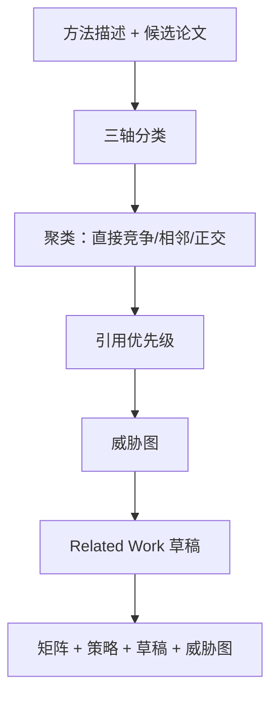

# ai-related-positioning — 与已有工作的差异化定位

AI 会议最常见的审稿意见之一是「相关工作不足」或「差异化不清」。本 skill 产出可辩护的**定位矩阵**与可经受审稿的 **Related Work** 草稿。

## 30 秒上手

```
"My method does X. How is it different from RULER, LongBench v2, Needle-in-haystack?"
"Position my work on diffusion editing vs InstructPix2Pix and Imagic."
"写 related work，对比 paper A/B/C/D，3 段。"
```

## 何时使用

| 使用 ai-related-positioning | 换用其他 skill |
|---|---|
| 已知可能重叠的论文，需阐明差异 | 尚不知对比哪些论文 → `ai-lit-scout` |
| 撰写 Related Work 小节 | 其他章节 → `ai-paper-writer` |
| 审稿人问「与 X 有何不同」 | 需要完整审稿报告 → `ai-paper-reviewer` |

## 输出概要

1. **定位矩阵**（CSV + Markdown）：方法轴 / 数据轴 / 主张轴。  
2. **引用策略**：`must-cite` | `contrast-cite` | `optional` | `skip`。  
3. **Related Work 草稿**（符合会议惯例）。  
4. **审稿人威胁图**：针对每篇直接竞争工作，预测审稿人可能攻击点与先发制人回应。

## 工作流



## Agents

| Agent | 角色 | 文件 |
|---|---|---|
| `triage_agent` | 三轴分类 | [`../../ai-related-positioning/agents/triage_agent.md`](../../ai-related-positioning/agents/triage_agent.md) |
| `cluster_agent` | 竞争邻近聚类 | [`../../ai-related-positioning/agents/cluster_agent.md`](../../ai-related-positioning/agents/cluster_agent.md) |
| `strategy_agent` | 引用优先级 | [`../../ai-related-positioning/agents/strategy_agent.md`](../../ai-related-positioning/agents/strategy_agent.md) |
| `threat_modeler_agent` | 审稿威胁 | [`../../ai-related-positioning/agents/threat_modeler_agent.md`](../../ai-related-positioning/agents/threat_modeler_agent.md) |
| `related_work_writer_agent` | 撰写小节 | [`../../ai-related-positioning/agents/related_work_writer_agent.md`](../../ai-related-positioning/agents/related_work_writer_agent.md) |

## 铁律

1. **差异化须具体**：不能只说「与 X 不同」，须指明**哪一轴**、**差多少**。  
2. **直接竞争对手不可漏引**：同方法同数据格内必须 `must-cite`。  
3. **威胁图对直接竞争对手非可选**。  
4. **遵守会议 Related Work 惯例**（见 `../../shared/venue_db/`）。  
5. **禁止幻觉论文**：候选文献必须可核验。

## 参考

- [`../../ai-related-positioning/references/positioning_axes.md`](../../ai-related-positioning/references/positioning_axes.md)
- [`../../ai-related-positioning/references/related_work_patterns_by_venue.md`](../../ai-related-positioning/references/related_work_patterns_by_venue.md)
- [`../../ai-related-positioning/references/concurrent_work_protocol.md`](../../ai-related-positioning/references/concurrent_work_protocol.md)
