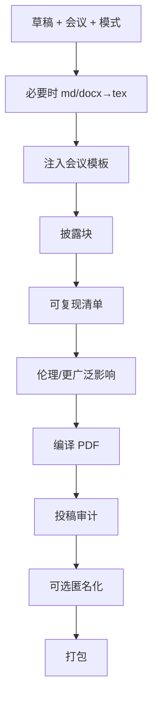

# ai-venue-formatter — AI 会议投稿打包

将草稿 + 图 + 书目转为**符合模板**的投稿包：正确注入会议 LaTeX、补全 **AI 披露 / 可复现性 / 更广泛影响**（若会议要求），并生成可提交的 PDF。

## 30 秒上手

```
"Compile this paper for NeurIPS submission."
"Format for ICLR; need anonymized version too."
"Fill the NeurIPS Reproducibility Checklist."
"打包成 NeurIPS 投稿。"
```

## 何时使用

| 使用 ai-venue-formatter | 换用其他 skill |
|---|---|
| 草稿已定稿需编译 | 仍在写正文 → `ai-paper-writer` |
| 需披露/可复现/影响段落 | 实验方法细节 → `ai-method-architect` |
| 录用后 camera-ready | 投稿前完整性 → `ai-integrity-check` |

## 输入与输出

`draft`、`venue`、`figures`、`bibliography`、`mode`（`submission` / `anonymized` / `camera-ready` / `arxiv-export`）、披露与可复现材料 — 见英文版。输出目录结构、`disclosure`、checklist、审计 YAML 同英文版。

## 工作流



## Agents（复用 v3）

| Agent | 文件 |
|---|---|
| `formatter_agent` | [`../../archive/v3/academic-paper/agents/formatter_agent.md`](../../archive/v3/academic-paper/agents/formatter_agent.md) |
| `citation_compliance_agent` | [`../../archive/v3/academic-paper/agents/citation_compliance_agent.md`](../../archive/v3/academic-paper/agents/citation_compliance_agent.md) |

## 关键协议

- [`../../shared/venue_db/`](../../shared/venue_db/) — 页数、模板、清单 URL  
- [`../../archive/v3/academic-paper/references/disclosure_mode_protocol.md`](../../archive/v3/academic-paper/references/disclosure_mode_protocol.md)  
- [`../../archive/v3/academic-paper/references/venue_disclosure_policies.md`](../../archive/v3/academic-paper/references/venue_disclosure_policies.md)

## 铁律

1. **页数上限为硬约束**；超标须用 `ai-paper-writer` 删减。  
2. **双盲匿名**须审计 GitHub、自引措辞等泄漏。  
3. **强制披露的会议**不可跳过；无 AI 也须声明范围。  
4. **必填可复现清单**须全部作答。  
5. **bib 须完整**。

## 参见

`ai-paper-writer`、`ai-figure-smith`、`ai-integrity-check`、`ai-rebuttal-coach`（camera-ready 修订计划）。
